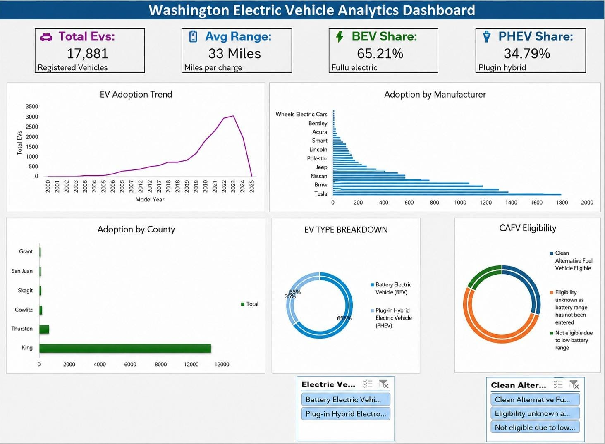

# 🚗 Washington Electric Vehicle Analytics Dashboard

An interactive **Microsoft Excel dashboard** analyzing electric vehicle adoption trends using real-world EV registration data.

## 📊 Project Overview

This project focuses on cleaning, analyzing, and visualizing electric vehicle data to identify important patterns and trends in EV adoption.

The dashboard analyzes **17,881 electric vehicle records** and provides insights into:

- EV adoption trends by model year
- EV adoption by manufacturer
- EV adoption by county
- Battery Electric Vehicle (BEV) vs Plug-in Hybrid Electric Vehicle (PHEV)
- CAFV eligibility
- Average electric range
- EV adoption patterns

## 🖥️ Dashboard Preview

## 🔑 Key Insights

- **17,881** electric vehicle records analyzed
- **33 miles** average electric range
- **65.21%** Battery Electric Vehicles (BEVs)
- **34.79%** Plug-in Hybrid Electric Vehicles (PHEVs)
- EV adoption trends analyzed across different model years
- Manufacturer-level and county-level EV adoption compared

## 🛠️ Tools & Skills

- Microsoft Excel
- Data Cleaning & Transformation
- Pivot Tables
- Pivot Charts
- KPI Development
- Interactive Slicers
- Data Visualization
- Dashboard Development
- Data Analysis

## 📁 Repository Contents

| File | Description |
|---|---|
| `Washington_EV_Analytics_Dashboard.xlsx` | Final Excel dashboard and analysis |
| `Electric_Vehicle_Population_Data_Project.csv` | Cleaned dataset used for the project |
| `dashboard-preview.jpeg` | Dashboard preview image |

## 🎯 Project Objective

The objective of this project was to transform raw electric vehicle registration data into an interactive dashboard that makes EV adoption trends easier to understand and supports data-driven analysis.

## 📈 Analysis Areas

The dashboard provides analysis across:

**Model Year → Manufacturer → County → EV Type → Electric Range → CAFV Eligibility**

## 💡 Skills Demonstrated

**Data Cleaning → Data Analysis → KPI Creation → Pivot Tables → Data Visualization → Dashboard Development → Business Insights**

## 👩‍💻 Author

**Gayatri Kanodia**

B.Sc. Information Technology Student | Data Analytics | Business Analytics | Microsoft Excel
